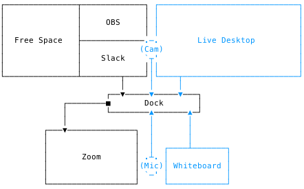

# Live Streaming @ Home

**[@droxey](https://github.com/droxey)'s streaming workstation**. Components in **blue** are integrated into OBS recordings and live streams.

## Component List

| ⚙️ Component | Name | In Use | Details |
| ------------- | ---- | :-----: | :----: |
| 🖥 **Monitors** | [LG 24UD58-B 24" 4K Monitor](https://www.lg.com/us/monitors/lg-24UD58-B-4k-uhd-led-monitor) _(2x)_ | ✅ | [⏬ Read More](#monitors) |
| 🎥 **Webcam** | [Razer Kiyo](https://www.razer.com/streaming-cameras/razer-kiyo/RZ19-02320100-R3M1) | ✅ | [⏬ Read More](#webcam) |
| 🎤 **Microphone** | [Yeti Nano](https://www.bluedesigns.com/products/yeti-nano/) | ✅ | [⏬ Read More](#microphone) |
| ✏️ **Whiteboard** | [iPad Pro 11" + Pencil](https://www.apple.com/ipad-pro/) | ✅ | [⏬ Read More](#whiteboard) |
| 🔗 **Dock** | [CalDigit USB-C Pro Dock](https://www.caldigit.com/usb-c-pro-dock/) | ✅ | [⏬ Read More](#dock) |
| 🚀 **Mission Control** | [Elgato Stream Deck](https://www.elgato.com/en/gaming/stream-deck) | _Wish List_ | [⏬ Read More](#stream-deck) |

## Component Details

### Monitors

_24 inch dual 4K monitors for extra screen real estate while streaming._

- **4K Resolution**: 4K monitors natively scale to the resolution you stream at in OBS. When you aren't streaming, scale back up for more screen real estate.

### Webcam

_**Note**: Any 720p webcam capable of at least 30 fps will improve the quality of your videos significantly. If you are unable to find a webcam in stock, consider using your smartphone's camera by setting up an NDI device in OBS._

- **720p Streaming**: Stream in 720p resolution @ 60 fps to maintain visual fidelity. 720p @ 60fps is the max resolution most streaming services will allow.
- **1080p Recording**: Record streams in 1080p using OBS.
- **Ring Light**: Maintains even and flattering light and reduces harsh shadows. Can be manually adjusted by twisting the light.
- **Auto Focus**: Sharp, precise, seamless footage; reduces motion blur.

### Microphone

_Plug and play microphone that adds high quality, 24 bit recording to your streams._

- **Two Polar Patterns**:
  - **Cardioid**: Single voice pickup mode for recording videos or conference calls.
  - **Omnidirectional**: Record or stream sound equally from all around the mic. Clearly records interviews and conference calls with multiple people in the same room.

### Whiteboard

_The iPad, combined with the Apple Pencil, provides a seamless transition to digital whiteboarding to enhance the interactivity of your streams._

- **Integrate with OBS**: Capture the display of the iPad to stream whiteboarding apps.

### Dock

_Connects your MacBook to multiple devices using a single Thunderbolt port._

- **4K Ready**: Can drive two 4K monitors (DisplayPort).
- **Ethernet Port**: Improve connection speed and reliability with a direct connection to your network.
- **2x USB 3 Ports**: Plug in your webcam and microphone to the high-bandwidth USB ports on the back of the dock.
- **USB-C Port**: Connect your iPad to the USB-C port on the front of the dock to use it as a whiteboard in your streams. **Directly connecting your iPad reduces lag when recording or streaming!**

### Stream Deck

- **Integrates with OBS**: Automatically detects OBS scenes, media, and audio sources, allowing you to control them with a keypress.
- **Interactive**: Program a button to insert GIFs, images, videos, and audio clips into the stream to respond to viewers (shoutouts, etc).
- **Fully Customizable**: Create your own buttons for custom actions using the [Key Creator](https://www.elgato.com/en/gaming/keycreator) software.
