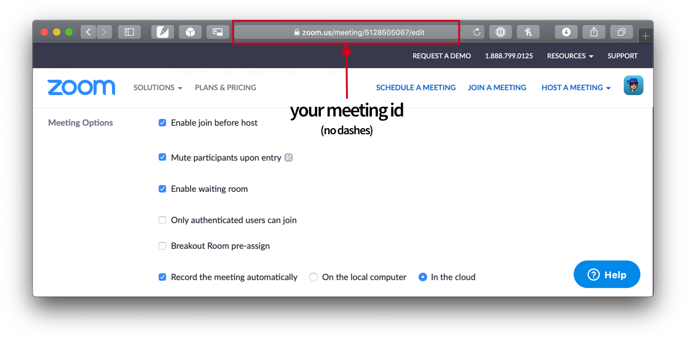
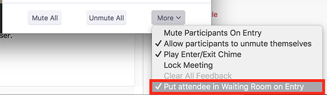
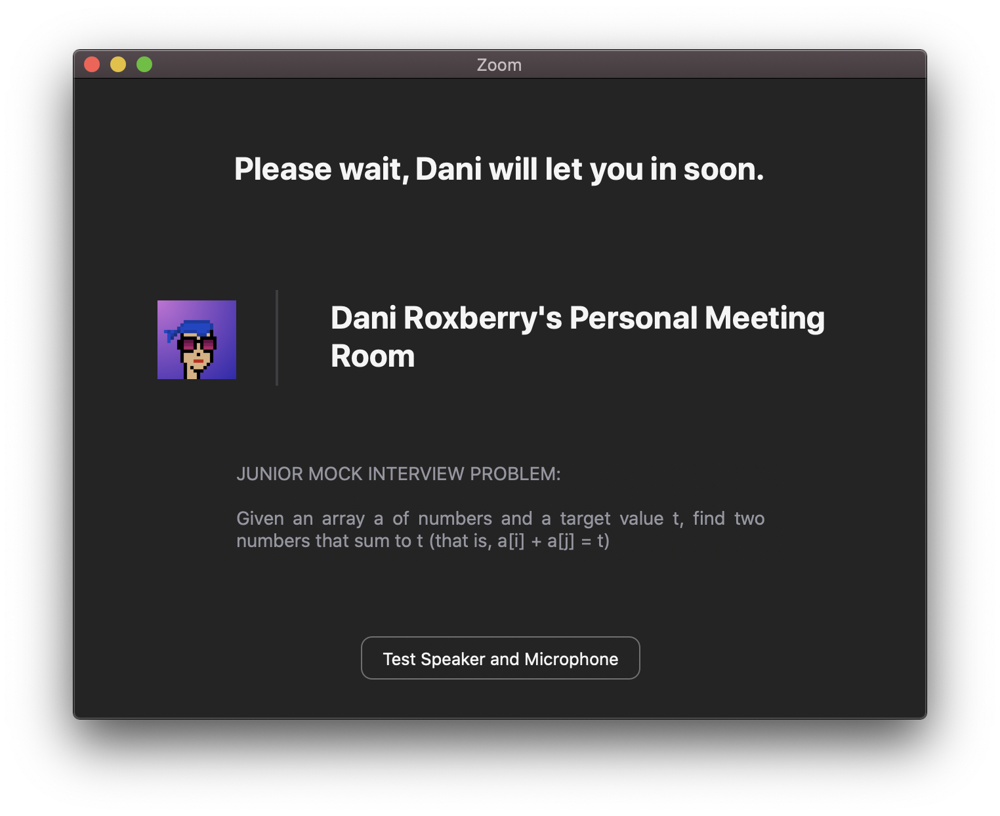
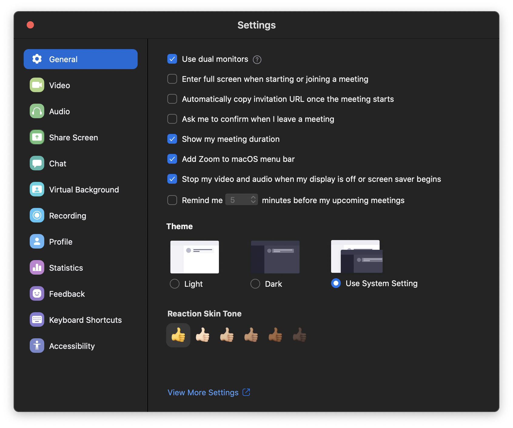

# Zoom Guide for Coaches & Instructors

<!-- omit in toc -->
## Table of Contents

1. [⚙️ Change Personal Meeting Room Settings](#%e2%9a%99%ef%b8%8f-change-personal-meeting-room-settings)
1. [📹 Overview of Enabled Features](#%f0%9f%93%b9-overview-of-enabled-features)
1. [✅ Optional Recommendations](#%e2%9c%85-optional-recommendations)

## ⚙️ Change Personal Meeting Room Settings

Visit your Personal Meeting settings and check the following **helpful options**:

## 📹 Overview of Enabled Features

- **Join Before Host**: Students can join the room before you arrive.
- **Mute on Entry**: So you don't have to ask every time you start a meeting.
- **Waiting Room**: Use this to ensure (by default) your one-on-one conversations (coaching, etc) remain private, and you aren't interrupted by anyone who might drop in to the room.
  - Before class, uncheck ***Manage Participants > More > Put attendee in Waiting Room on Entry*** setting located in the ***Manage Participants*** tab.

    

  - Customize the waiting room with welcome text, logo, and description in the . Here's an example of how I customized mine today for junior mock interviews:

    

- **Record Automatically to Cloud**: It's a good idea to record to cloud by default. Later, you can reference the recording to assist students, create a reusable video from the content, or delete it if it is no longer relevant.

## ✅ Optional Recommendations

- Complete your [Zoom Profile](https://zoom.us/profile). Many options are helpful for managing online course delivery.
  - Change your Personal Meeting ID to something memorable. I use my phone number.
  - Connect to your Google Calendar to show your schedule on the Zoom home screen.
- Consider using an additional monitor dedicated to the Zoom meeting room.
- Configure your Zoom app by opening Preferences. Here's mine:
  
